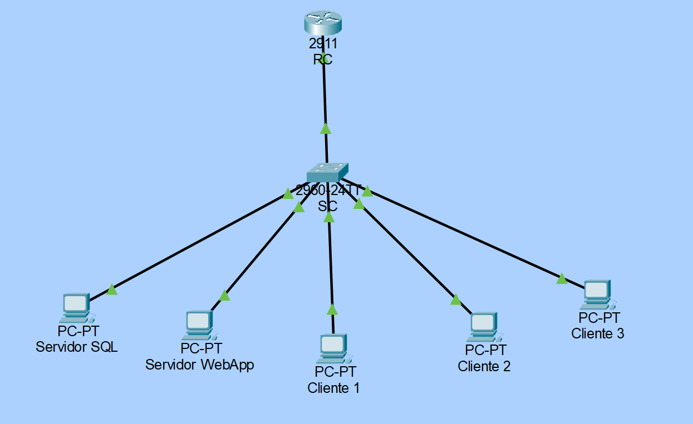

# Proyecto Integrador del 4° Semestre Grupo B - Ingeniería en TIC's, ITSOEH

## **Datos del Equipo**  
**Institución**: Instituto Tecnológico Superior del Occidente del Estado de Hidalgo.  
**Programa Educativo**: Ingeniería en Tecnologías de la Información y Comunicaciones.  
**Semestre y Grupo**: 4° "B".  
**Asignatura**: Fundamentos de Redes.  

**Integrantes**:  
- Edwin Salvador Soto Hernandez (230110358)  
- Gerardo Daniel Olivares Alvarez (230110052)  
- Dilan Emir Angeles Martinez (230110252)  
- José María Ortiz Escamilla (230110337)  
- Luis Fernando Gonzaga López (230110528)  

---

**Propósito del Proyecto Integrador: Topología de Red para Sistema de Gestión de Talleres**  

El presente proyecto tiene como objetivo diseñar e implementar una topología de red escalable y segura para el **Sistema de Gestión de Talleres** del Instituto Tecnológico Superior del Occidente del Estado de Hidalgo. Esta infraestructura garantizará la comunicación eficiente entre los componentes críticos del sistema, como el **servidor SQL** (encargado de almacenar datos de talleres, alumnos y docentes), los **clientes** (estaciones de trabajo administrativas y docentes), y los dispositivos de red (**Router y Switch**), utilizando protocolos duales **IPv4 e IPv6** para asegurar compatibilidad y futuro crecimiento.  

---

## **Alcance Técnico de la Topología**  
1. **Direccionamiento IP**:  
   - Se implementará una subred **IPv4 clase C privada (172.16.0.0/24)** con división en subredes para seccionar el espacio de direcciones.  
   - El **servidor SQL** ocupará la primera dirección asignable de la subred, garantizando accesibilidad prioritaria.  
   - La **Vlan1 del Switch** utilizará la última dirección disponible para administración.  
   - La interfaz **GigabitEthernet 0/0 del Router** se configurará con la antepenúltima dirección, actuando como gateway predeterminado para los clientes.  
   - Los **clientes** se distribuirán en direcciones intermedias dentro del rango permitido.  

2. **Protocolo IPv6**:  
   - Se asignarán direcciones **Global Unicast (2001:db8::/64)** y **Link-Local** automáticas para garantizar conectividad en entornos modernos y preparar la red para la transición total a IPv6.  

3. **Configuraciones Clave**:  
   - **Router**: Activación de enrutamiento IPv6, seguridad con contraseñas cifradas (Secret) y acceso remoto SSH.  
   - **Switch**: Configuración de VLAN1 con dirección IPv4, gateway y descripción para gestión centralizada.  
   - **Dispositivos Finales**: Asignación estática de IPv4/IPv6 y gateway para clientes y servidor.  

---
## **Cálculo de nuestra Subred (Equipo 3)**  
**Dirección IP:** 172.16.0.0 /24  
**Máscara:** 255.255.255.0  
**Número de Subredes:**
     
**Nueva máscara:** 255.255.255.224  =  /27   

<table>
    <tr>
        <td> <strong>172.16.0.</strong> </td>
        <td> <strong>128</strong> </td>
        <td> <strong>64</strong> </td>
        <td> <strong>32</strong> </td>
        <td> <strong>16</strong> </td>
        <td> <strong>8</strong> </td>
        <td> <strong>4</strong> </td>
        <td> <strong>2</strong> </td>
        <td> <strong>1</strong> </td>
        <td> 
            <strong>Network ID</strong>
            <p style="text-align: center">
            <strong>Broadcast</strong>
            </td>
            <td><strong>1er Dirección</strong>
            <p style="text-align: center">
            <strong>Ult. Dirección</strong>
        </td>
    </tr>
    <tr>
        <td rowspan="2" > <strong>Equipo 1</strong> </td>
        <td>0 </td>
        <td>0 </td>
        <td>0 </td>
        <td> </td>
        <td> </td>
        <td> </td>
        <td> </td>
        <td> </td>
        <td> </td>
        <td> </td>
    </tr>
    <tr>
        <td> 0 </td>
        <td> 0 </td>
        <td> 0 </td>
        <td> </td>
        <td> </td>
        <td> </td>
        <td> </td>
        <td> </td>
        <td> </td>
        <td> </td>
    </tr>
    <tr>
        <td rowspan="2" ><strong>Equipo 2</strong></td>
        <td>0</td>
        <td>0</td>
        <td>1</td>
        <td></td>
        <td></td>
        <td></td>
        <td></td>
        <td></td>
        <td></td>
        <td></td>
    </tr>
    <tr>
        <td>0</td>
        <td>0</td>
        <td>1</td>
        <td></td>
        <td></td>
        <td></td>
        <td></td>
        <td></td>
        <td></td>
        <td></td>
    </tr>
    <tr>
        <td rowspan="2" ><strong>Equipo 3</strong></td>
        <td>0</td>
        <td>1</td>
        <td>0</td>
        <td>0</td>
        <td>0</td>
        <td>0</td>
        <td>0</td>
        <td>0</td>
        <td>172.16.0.64</td>
        <td>172.16.0.65</td>
    </tr>
    <tr>
        <td>0</td>
        <td>1</td>
        <td>0</td>
        <td>1</td>
        <td>1</td>
        <td>1</td>
        <td>1</td>
        <td>1</td>
        <td>172.16.0.95</td>
        <td>172.16.0.94</td>
    </tr>
</table>

--- 

## **Direccionamiento de nuestra subred**

<table>
    <tr>
        <td colspan="5" > <strong>Router RC</strong> </td>
    </tr>
    <tr>
        <td> <strong>Interface</strong> </td>
        <td> <strong>IPv4</strong> </td>
        <td> <strong>Máscara</strong> </td>
        <td> <strong>IPv6 Link-Local</strong> </td>
        <td> <strong>IPv6 Global (eui-64)</strong> </td>
    </tr>
    <tr>
        <td> GigabitEthernet 0/0 </td>
        <td> 172.16.0.92 </td>
        <td> 255.255.255.224 </td>
        <td> Automática </td>
        <td> 2001:db8:1:c::/64 </td>
    </tr>
</table>

<table>
    <tr>
        <td colspan="5" ><strong>Switch SC</strong> </td>
    </tr>
    <tr>
        <td> <strong>Interface</strong> </td>
        <td> <strong>IPv4</strong> </td>
        <td> <strong>Máscara</strong> </td>
        <td> <strong>IPv6 Link-Local</strong> </td>
        <td> <strong>IPv6 Global (eui-64)</strong> </td>
    </tr>
    <tr>
        <td> VLAN 1 </td>
        <td> 172.16.0.94 </td>
        <td> 255.255.255.224 </td>
        <td> Automática </td>
        <td> 2001:db8:1:c::/64 </td>
    </tr>
</table>

<table>
    <tr>
        <td colspan="5" ><strong>Computadoras</strong> </td>
    </tr>
    <tr>
        <td> <strong>Dispositivo</strong> </td>
        <td> <strong>IPv4</strong> </td>
        <td> <strong>Máscara</strong> </td>
        <td> <strong>Default Gateway</strong> </td>
        <td> <strong>IPv6 y Link-Local</strong> </td>
    </tr>
    <tr>
        <td> Servidor SQL </td>
        <td> 172.16.0.65 </td>
        <td rowspan="5" > 255.255.255.224 </td>
        <td rowspan="5" > 172.16.0.92 </td>
        <td rowspan="5" > Autoasignadas </td>
    </tr>
    <tr>
        <td> Cliente 1 </td>
        <td> 172.16.0.66 </td>
    </tr>
    <tr>
        <td> Cliente 2 </td>
        <td> 172.16.0.67 </td>
    </tr>
    <tr>
        <td> Cliente 3 </td>
        <td> 172.16.0.68 </td>
    </tr>
    <tr>
        <td> Cliente 4 </td>
        <td> 172.16.0.69 </td>
    </tr>
</table>


--- 

## **Topología**
    
La simulación de la topología esta en: <a href="Proyecto_Integrador.pkt">Proyecto_Integrador.pkt</a>  

---

## **Configuraciones**
### **Router RC**
1. **Asignar nombre del host**
2. **Configurar Banner**
3. **Configurar contraseñas:**
   - Contraseña no cifrada (Password)
   - Contraseña cifrada (Secret)
   - Contraseña de la consola
   - Cifrar todas las contraseñas
4. **Configurar acceso remoto:**
   - Telnet
   - SSH
5. **Activar el enrutamiento IPv6**
6. **Configuración de la interface GigabitEthernet:**
   - Asignar IPv4 y máscara de subred
   - Asignar dirección Global IPv6
   - Asignar dirección link-local IPv6
   - Agregar una descripción

<details> 
    <summary>
        Configuraciones hechas en el Router RC
    </summary>
    <pre>
Router> enable
Router# configure terminal
RC(config)# hostname RC
RC(config)# banner motd #Acceso Restringido#
RC(config)# enable password cisco
RC(config)# enable secret tics

RC(config)# line console 0
RC(config-line)# password console
RC(config-line)# login
RC(config-line)# exit

RC(config)# line vty 0 4
RC(config-line)# password telnet
RC(config-line)# login
RC(config-line)# transport input telnet
RC(config-line)# exit

RC(config)# service password-encryption

RC(config)# username admin password admin
RC(config)# ip domain-name cisco.com
RC(config)# crypto key generate rsa
How many bits in the modulus [512]: 1024
RC(config)# line vty 0 4
RC(config-line)# transport input ssh telnet
RC(config-line)# login local
RC(config-line)# exit

RC(config)# ipv6 unicast-routing
RC(config)# interface g 0/0
RC(config-if)# ip address 172.16.0.92 255.255.255.224
RC(config-if)# ipv6 address 2001:db8:1:c::/64 eui-64
RC(config-if)# ipv6 enable
RC(config-if)# description ”to LAN C”
RC(config-if)# no shutdown
RC(config-if)# exit
SC(config)#
    </pre>
</details>

### **Switch RC**
1. **Asignar nombre del host**
2. **Configurar Banner**
3. **Configurar contraseñas:**
   - Contraseña no cifrada (Password)
   - Contraseña cifrada (Secret)
   - Contraseña de la consola
   - Cifrar todas las contraseñas
4. **Configurar acceso remoto:**
   - Telnet
   - SSH
5. **Activar el uso de IPv4 e IPv6**
6. **Configuración de la interface Vlan1**
   - Asignar IPv4 y máscara de subred
   - Asignar el default gateway
   - Asignar dirección Global IPv6
   - Asignar dirección link-local IPv6
   - Agregar una descripción

<details> 
    <summary>
        Configuraciones hechas en el Switch SC
    </summary>
    <pre>
Switch> enable
Switch# configure terminal
Switch# prefer dual-ipv4-and-ipv6 default
Switch# end
Switch# reload
######################################################################################################
Switch> enable
Switch# configure terminal
SC(config)# hostname SC
SC(config)# banner motd #Acceso Restringido#
SC(config)# enable password cisco
SC(config)# enable secret tics

SC(config)# line console 0
SC(config-line)# password console
SC(config-line)# login
SC(config-line)# exit

SC(config)# line vty 0 15
SC(config-line)# password telnet
SC(config-line)# login
SC(config-line)# transport input telnet
SC(config-line)# exit

SC(config)# service password-encryption

SC(config)# username admin password admin
SC(config)# ip domain-name cisco.com
SC(config)# crypto key generate rsa
How many bits in the modulus [512]: 1024
SC(config)# line vty 0 4
SC(config-line)# transport input ssh telnet
SC(config-line)# login local
SC(config-line)# exit

SC(config)# ip default-gateway 172.16.0.92
SC(config)# interface vlan 1
SC(config-if)# ip address 172.16.0.94 255.255.255.224
RC(config-if)# ipv6 address 2001:db8:1:c::/64 eui-64
RC(config-if)# ipv6 enable
SC(config-if)# no shutdown
SC(config-if)# description “to Admin”
SC(config-if)# exit
SC(config)#
    </pre>
</details>

### **Configuraciones básicas de los clientes y servidor SQL**  
1. **Desactivar Firewall**  
2. **Asignar IP estática**:  
   - IPv4: `172.16.0.X`
   - Máscara: `255.255.255.224`  
   - Gateway: `172.16.0.94`  

### **Verificación IPv6**
```bash
# Windows:
ipconfig | findstr "IPv6"  
ping -6 fe80::1%15  

# Cisco:
show ipv6 interface brief  
ping ipv6 2001:db8:1:c::1  
```

```console
Switch> enable
Switch# configure terminal
Switch(config)# hostname SC
SC(config)# banner motd #Acceso Restringido#
```

```bash
SC(config)# enable secret **tics**  # 🔐 Contraseña cifrada
SC(config-if)# ip address **172.16.0.94** 255.255.255.224  # 🌐 IPv4
```
